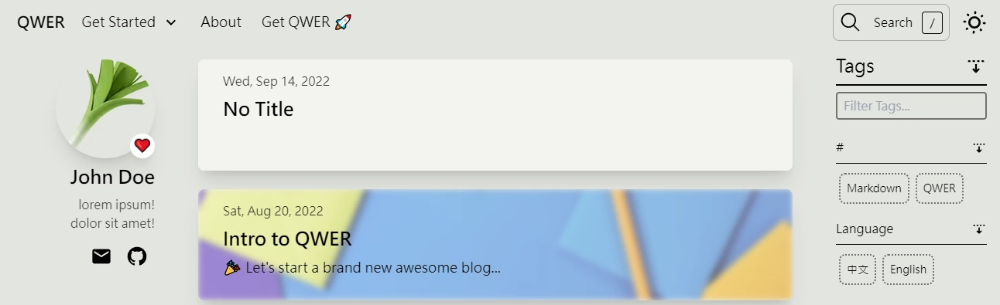

# 🎉 Getting Started with QWER

This post will guide you through deploying your first [QWER](https://github.com/kwchang0831/svelte-QWER) blog site.


## Step 1. Prepare the Environment

1. Get [node.js](https://nodejs.org/).

   v18.16.0 LTS

2. Get [pnpm](https://pnpm.io/).

   ```sh
   npm i -g pnpm
   ```

## Step 2. Create a new proejct

1. Create a QWER blog named `my-blog`.

   ```sh
   npx degit kwchang0831/svelte-QWER my-blog
   ```

1. Change into the project.

   ```sh
   cd my-blog
   ```

1. Install all the dependencies.

   ```sh
   pnpm i
   ```

1. Set up husky.

   ```sh
   pnpm husky
   ```

## Step 3. Boot up dev environment

1. Start local dev server.

   ```sh
   pnpm dev
   ```

1. Sever is running. Open browser to see the result.

   ```shell
   VITE v3.x.x  ready in 1080 ms

   ➜  Local:   http://localhost:5173/
   ➜  Network: use --host to expose
   ```

## Step 4. Changing configs

Go to `user/config/site.ts` to customize your site settings.

::: info

For `siteConfig.url`, you will get your own url after deploying onto [Vercel](https://vercel.com).

:::

See [Config](/config/site-ts) for more details, otherwise you may continue.

## Setp 5. Add a post

Create a post by adding a new file under `user/blogs/first-post/index.md`.

```txt
.
├─ user
│  └─ blogs
│     └─ first-post
│        └─ index.md
```

This will generate a new page at `/first-post`, and your front page will look like the following:



You will be writing the post content using Markdown Syntax and Customize Post Metadata through Frontmatter.

And, that is how QWER works basically. The directory structure corresponds with the URL path.

## Step 5. Deploy

1. Create a free [Vercel](https://vercel.com/) account.

1. Install Vercel CLI

   ```sh
   npm i -g vercel
   ```

1. Using the vercel command from the root of a project directory.

   ```sh
   vercel
   ```

   You will be asked to login for the first time. Simply follow its' instruction.

1. Deploy as Production build

   ```sh
   vercel deploy --prod
   ```

If everying goes smoothly, you should now sucessfully deployed onto vercel.

You can go ahead check [Vercel Dashboard](https://vercel.com/dashboard) for your site url. And, come back `user/config/site.ts` to change it, then deploy it again.

## What's Next?

By now, you should have a basic and functional [QWER](https://github.com/kwchang0831/svelte-QWER) blog site deployed and ready to show other people what you have built.

Next, you should start writing your own blogs using Markdown Syntax and remove all the example blogs. And, learn more about FrontMatter and User configurations.

Otherwise, you could check out [QuickStart for Customizing](/customize/quick-start).
