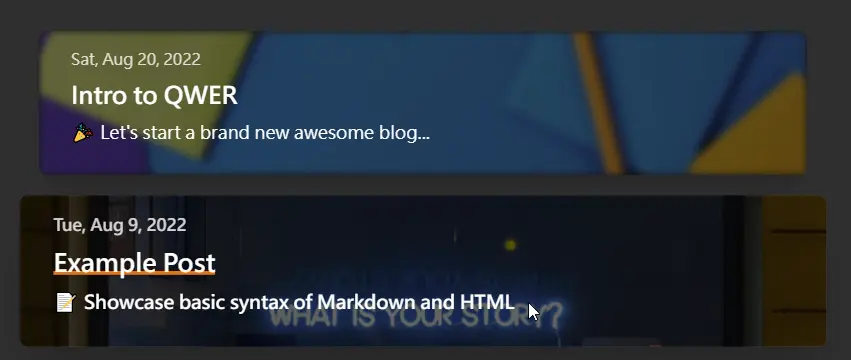
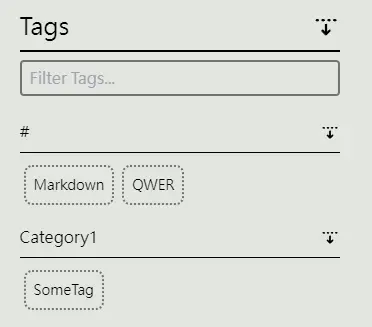

# Front Matter

Front matter allows you to keep metadata attached to an Markdown file. The front matter must be placed at the top of the Markdown file. You will write the front matter block using [YAML syntax](https://yaml.org/) between triple-dashed lines. For Example:

```yaml
---
title: Example Post
description: Example post writen using Markdown Syntax with QWER - Simply Awesome Blog Starter. Built using SvelteKit and Love.
summary: 📝 Showcase basic syntax of Markdown and HTML
published: '2022-08-09T00:00:00.000+08:00'
updated: '2022-09-12T00:00:00.000+08:00'
---
```

These metadata are used to describe the post, alter the way QWER display the post, fullfil SEO metadata, and so on. Full list of attributes are listed below.

## title

- Type: `string`
- Default: `undefined`
- Used for: SEO page title, Post-Listing title, Post heading title, Post Prev/Next Navgiation title.

```yaml
---
title: Example Post
---
```

## description

- Type: `string`
- Default: `undefined`
- Used for: SEO page description. This will be displayed in search engine result.

```yaml
---
description: Example post writen using Markdown Syntax with QWER - Simply Awesome Blog Starter. Built using SvelteKit and Love.
---
```

## summary

- Type: `string`
- Default: `undefined`
- Used for: Post-Listing only.



```yaml
---
summary: 📝 Showcase basic syntax of Markdown and HTML
---
```

## language

The written language for the post.

- Type: `string`
- Default: `Config.DefaultPostLanguage`
- Used for: Post Tag.

You could use it for human language or computer language. It will shows up in tag filtering section.

```yaml
---
language: español
---
```

## published

The DateTime of the post published.

- Type: `dateString`
- Default: `statSync(file).birthtime`
- Used for: Post-Listing, Post Heading, SEO Meta, Atom Feed, Json Feed, and Post-Listing sorting.

The format of `dataString`, please check [MSDN #Date string](https://developer.mozilla.org/en-US/docs/Web/JavaScript/Reference/Global_Objects/Date/Date#date_string).

```yaml
---
published: '2022-08-09T00:00:00.000+08:00'
---
```

::: tip
Please Noted: Git repository does not store timestamp information of files. Meaning if you clone it elsewhere the published time will become the time you cloned the repo. Thus, it's recommended to manually input the published time.
:::

## updated

The DateTime of the post updated.

- Type: `dateString`
- Default: `statSync(file).mtime`
- Used for: Post-Listing, Post Heading, SEO Meta, Atom Feed, Json Feed.

The format of `dataString`, please check [MSDN #Date string](https://developer.mozilla.org/en-US/docs/Web/JavaScript/Reference/Global_Objects/Date/Date#date_string).

```yaml
---
updated: '2022-09-12T00:00:00.000+08:00'
---
```

::: tip
Please Noted: Git repository does not store timestamp information of files. Meaning if you clone it elsewhere the updated time will become the time you cloned the repo. Thus, it's recommended to manually input the updated time.
:::

## cover

The path to the cover image.

- Type: `string`
- Default: `undefined`
- Used for: Post-Listing, Post Heading, SEO Meta, Atom Feed, Json Feed.

```yaml
---
cover: ./cover.jpg
---
```

It takes relative path `./image.jpg` or `/favicon.png`, or absolute path `https://svelte-qwer.vercel.app/favicon.png`.

For more information about relative path, see [Image Asset Handling](/writing/image-asset-handling).

## coverCaption

The caption text for the cover image. The text shows under the cover image.

- Type: `string`
- Default: `undefined`
- Used for: Post Heading.

```yaml
---
coverCaption: Photo by <a href="https://unsplash.com/@etiennegirardet?utm_source=unsplash&utm_medium=referral&utm_content=creditCopyText">Etienne Girardet</a> on <a href="https://unsplash.com/s/photos/motivation?utm_source=unsplash&utm_medium=referral&utm_content=creditCopyText">Unsplash</a>
---
```

::: tip

The `coverCaption` takes plain text or HTML text. The input will NOT be sanitized.

:::

## coverStyle

The position of cover image display on post-listing.

- Type: `'TOP' | 'RIGHT' | 'BOT' | 'LEFT' | 'IN' | 'NONE'`
- Default: `Config.DefaultCoverStyle`
- Used for: Post-Listing.

```yaml
---
coverStyle: 'IN'
---
```

## options

The setting of the post

- Type: `string[]`
- Default: `undefined`
- Used for: Post Behavior.

```yaml
---
options:
  - unlisted
---
```

All the current supported options are listed below:

### unlisted

Make post not showing up in the post-listings, the post become only accessable with url.

```yaml
---
options:
  - unlisted
---
```

## series_tag

Create Series Tag for the post. This is used in conjunction with `series_title`

- Type: `string`
- Default: `undefined`
- Used for: Post-Listing.

```yaml
---
series_tag: 'Learn-Elixir'
---
```

## series_title

Create Series Title for the post. This is used in conjunction with `series_tag`

- Type: `string`
- Default: `undefined`
- Used for: Post-Listing.

```yaml
---
series_title: ⚡ Let's Learn Elixir 🧪
---
```

## tags

Assoicate post with tags for filtering purpose.

- Type: `string[]`
- Default: `undefined`
- Used for: Tag filtering.

The following example would both work.

```yaml
---
tags:
  - Ubuntu
  - Windows
  - Elixir
---
```

```yaml
---
tags:
  - [Ubuntu, Windows, Elixir]
---
```

### Taxonomy

You could also use create a category of tags. Currently does NOT support nested categories.

```yaml
---
tags:
  - 'Category1': [SomeTag]
---
```


